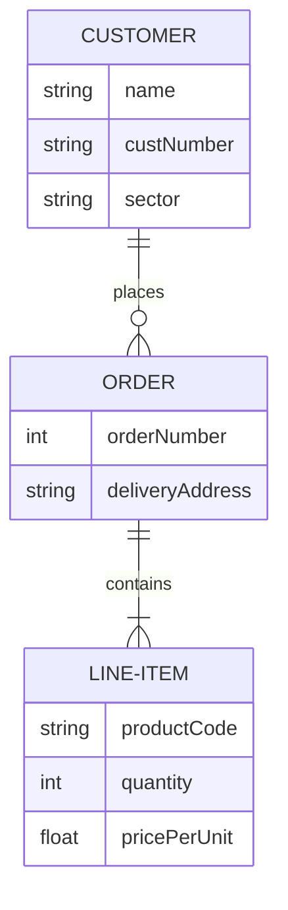
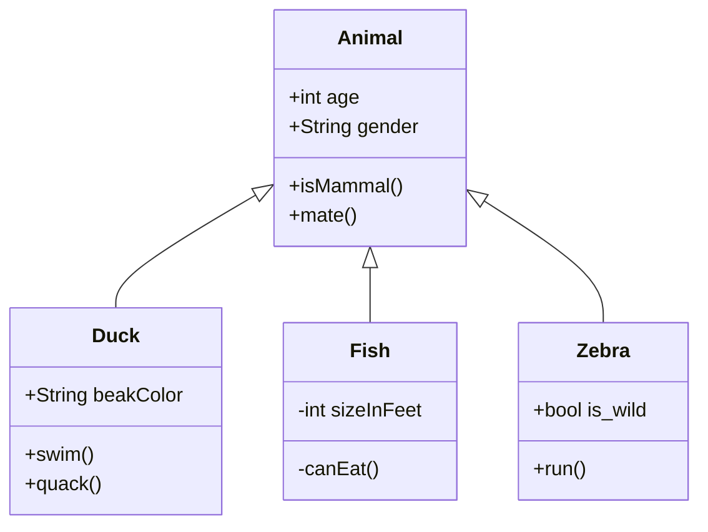
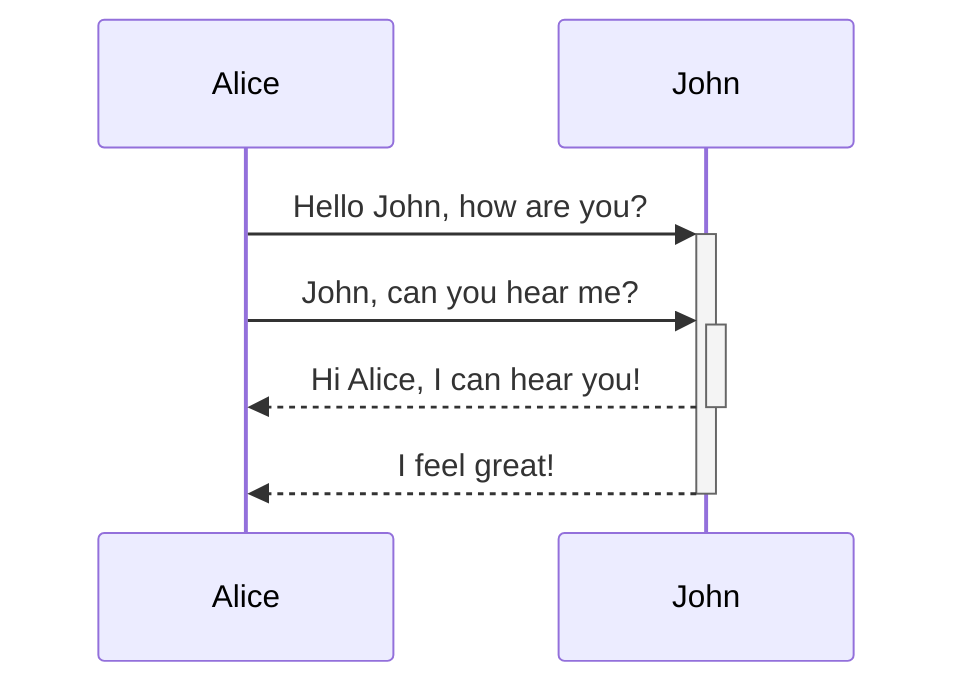
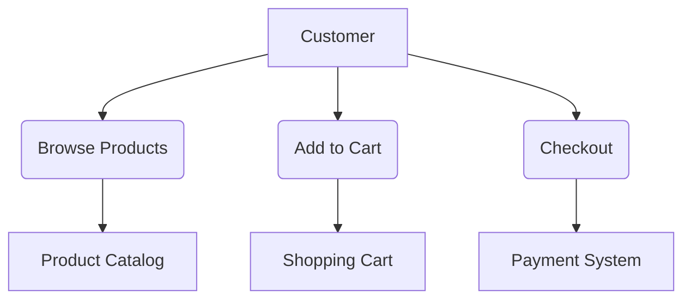
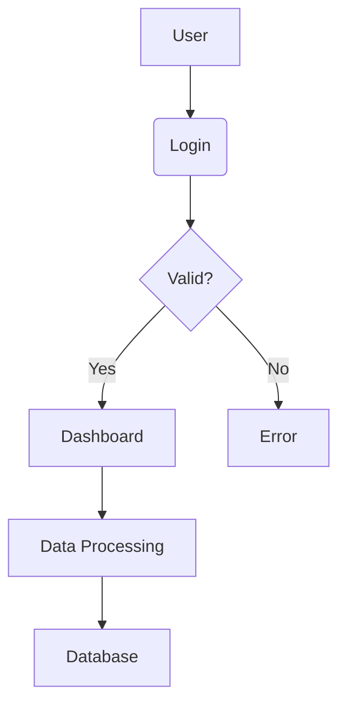
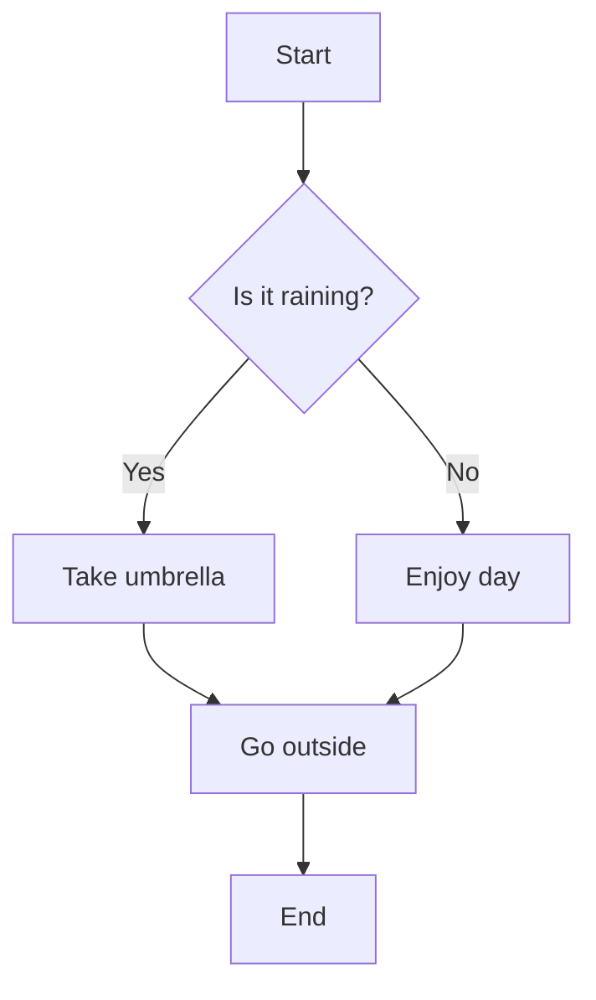
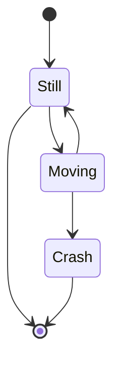

# Diagrams: UML, ERD, Crow's Foot, etc.

This file contains text-based diagrams using Mermaid syntax. Copy-paste into a Mermaid renderer (e.g., GitHub, VS Code extension) to visualize.

## ERD (Entity-Relationship Diagram) with Crow's Foot Notation
Crow's Foot shows multiplicity: | (one), < (many), etc.

- **Explanation**: Customer (one) places Orders (many); Order (one) contains Line-Items (many).

## UML Class Diagram
Shows classes, attributes, methods, relationships.

- **Explanation**: Inheritance (Animal subclasses); + public, - private.

## UML Sequence Diagram
Shows interactions over time.

## UML Use Case Diagram
Shows actors and use cases.

## Data Flow Diagram (DFD)
Shows data flow in systems.

## Flowchart
For algorithms/processes.

## State Diagram
Shows states and transitions.

For more, use tools like Lucidchart or Draw.io to create visuals, then export. If you need specific examples (e.g., for databases), let me know! These render in VS Code with the Mermaid extension. Good luck! 